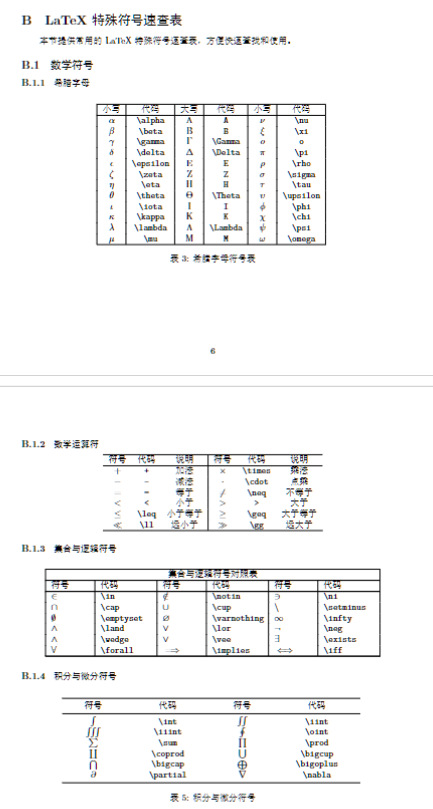

# 中文LaTeX论文模板

这是一个简单的中文LaTeX论文模板，使用XeTeX编译引擎以支持中文字体。

示例文件的文末有 $\LaTeX{}$ 速查表，可以查阅或者打印。



本文基于 Overleaf 的默认模板进行了修改，适用于撰写中文论文、报告或学位论文。但是具体的任务还是应该参阅具体的需求，并进行针对性修改。

请注意字体的版权问题。默认个人使用，且我目前使用的是Windows系统，自带全部字体。

存在一些相对复杂的示例，也有相对简单的。

请注意本模板使用了 XeLaTeX 编译器，因此需要确保您的 LaTeX 环境支持 XeTeX。

此外，由于 Overleaf 的免费版本只有 20s 的编译时间限制，或许无法在线编译。不过本项目暂时也不面对 Overleaf 优化。

我们还保留了兼容 luaLaTeX 的代码。

本模板或也发布于 OverLeaf。

## 特性

- 使用XeTeX编译引擎
- 支持中文字体（宋体、黑体）
- 自动生成中文标签（摘要、图、表等）
- 包含常用的论文元素示例

## 编译方法

### 使用XeLaTeX命令行编译：
```bash
xelatex main.tex
bibtex main
xelatex main.tex
xelatex main.tex
```

### 使用提供的批处理文件（Windows）：
```bash
compile.bat
```

## 字体要求

确保系统中安装了以下中文字体：
- 宋体 (SimSun)
- 黑体 (SimHei)
- 楷体 (KaiTi)
- 仿宋 (FangSong)
- 隶书 (LiShu)

如果您的系统使用不同的字体名称，请在main.tex中相应修改`\setCJKmainfont`和`\setCJKsansfont`的设置。一般情况下，Windows用户无需修改，但是Linux等平台应留意。

## 文件结构

- `main.tex` - 主文档文件
- `sample.bib` - 参考文献数据库
- `frog.jpg` - 示例图片
- `compile.bat` - Windows编译脚本

## 注意事项

- 推荐使用XeLaTeX编译器
- 首次编译可能需要安装相关字体包
- 建议使用支持XeTeX的LaTeX编辑器，如TeXworks、TeXstudio等；或者VS Code的LaTeX Workshop插件。
- 部分内容是AIGC，请知悉。

Edited from Overleaf's default template
